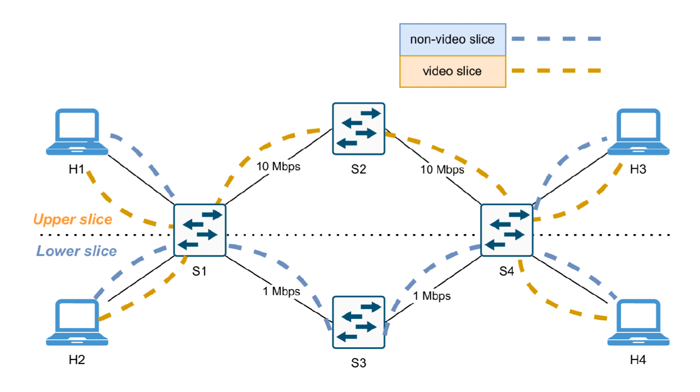

# SDN Network & Service Slicing – Project README

## 📌 Descrizione del Progetto
Questo progetto implementa un sistema completo di **Network Slicing** all’interno di un ambiente **Software Defined Networking (SDN)** utilizzando:

- **Mininet** come emulatore di rete  
- **Ryu SDN Controller** per la gestione del control plane  
- **OpenFlow 1.3** come protocollo tra controller e switch  

L'obiettivo è realizzare:
1. **Topology Slicing** – isolamento di percorsi e coppie di host  
2. **Service Slicing** – differenziazione del traffico (video vs non-video)  
3. **Dynamic Slicing** – adattamento dinamico dei percorsi in base al traffico  
4. **Dashboard di monitoraggio** – statistiche e throughput in tempo reale  

---

## 📁 Struttura dei File

| File |
|------|
| `topology_slicing.py` |
| `controller_slicing.py` |
| `controller_service.py` |
| `controller_service_optional.py` |
| `dashboard.py` |
| `monitorare.txt` |

---

## 🕸️ Architettura di Rete
La topologia è composta da:

- 4 Host: **H1, H2, H3, H4**  
- 4 Switch OpenFlow 1.3: **S1, S2, S3, S4**  
- Due percorsi separati tra S1 e S4:  
  - **Upper Slice (S1–S2–S4)** → 10 Mbps  
  - **Lower Slice (S1–S3–S4)** → 1 Mbps  

Mappatura host-slice:

- **H1 ↔ H3** → Upper slice  
- **H2 ↔ H4** → Lower slice  

---

## 🧩 Funzionalità Implementate

### ✅ 1. Topology Slicing
- Isolamento totale tra i percorsi degli host  
- Regole OpenFlow statiche  
- ARP forwarding controllato  
- Drop di tutti i flussi non autorizzati  

### ✅ 2. Service Slicing
Il traffico viene suddiviso in due categorie:

| Tipo di Traffico |
|------------------|
| Video (UDP) |
| Non-video (TCP/ICMP/UDP generico) |

### ✅ 3. Dashboard di Monitoraggio
La dashboard mostra in tempo reale:

- throughput per switch  
- statistiche delle porte  
- identificazione dei flussi attivi  
- aggiornamenti periodici ogni 10 secondi  

### 🔄 4. Dynamic Slicing
Il controller modifica le regole in funzione del traffico video:

- Se il traffico video **non è attivo** → il traffico non-video può usare anche la slice superiore  
- Se il traffico video **è attivo** → tutto il traffico non-video viene spostato sulla slice inferiore  

---

## 📝 Conclusioni
Il progetto dimostra l’efficacia delle tecniche di **Network Slicing** integrate con SDN, ottenendo:

- isolamento dei flussi e dei percorsi  
- gestione differenziata del traffico  

---

## 👥 Autori
- **Camilla D’Andria**  
- **Pietro Conte**

**Corso:** Network and Cloud Infrastructures  
**Docente:** Prof. Giorgio Ventre  
**Università degli Studi di Napoli Federico II**  
**Anno Accademico:** 2024–2025
